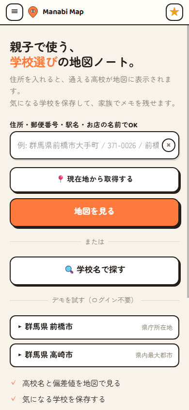
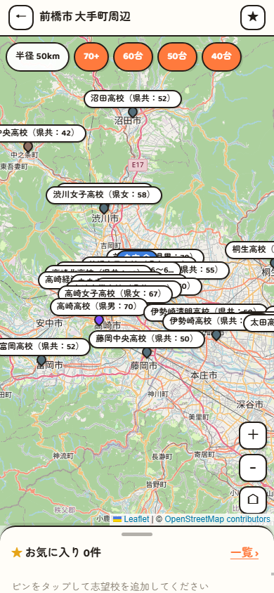

# 親子で使う、学校選びの地図ノート。

住所を入れると、周辺の高校が地図に出てきます。
気になる学校はワンタップでお気に入りに保存できます。
文化祭・説明会・通学経路・親子の感想を、学校ごとに家族でメモとして残せます。

**公開中 → https://manabi-map.app** （群馬県版・v0.2.0 関東展開はリリース準備中）

## 動作環境

- Web ブラウザで完結（アプリのインストール不要）
- スマホブラウザでの利用に最適化（基準画面幅 390px・iPhone 標準サイズ）
- ブラウザの「ホーム画面に追加」でアプリのように使えます（PWA・オフライン対応は今後拡充）

## スクリーンショット

  
  

## 使い方

1. **住所を入力する** — トップページに自宅の住所を入れると、周辺の高校が地図に表示されます
2. **気になる学校を保存する** — 地図上の学校をタップして、気になる学校をお気に入りに追加します
3. **家族でメモを共有する** — 文化祭や説明会で見聞きしたこと、通学経路の感想などを学校ごとに書き込みます。同じ LINE アカウントでログインすれば PC とスマホでメモが同期します

## 偏差値の扱いについて

掲載している偏差値は **Manabi Map 独自の推計値** です。公的資料（教育委員会の公表情報等）に基づいて算出しており、特定の商用サイトや塾の資料からの転載は行っていません。

内容に誤りや修正すべき点を見つけた場合は、下記いずれかの方法でご連絡ください。

- GitHub Issue（`data-correction` ラベル）
- メール: takedown@manabi-map.app

## ライセンス

- **著作権**: Copyright (c) 2026 Hiroshi Ishizaka (ishizakahiroshi)
- **コード**: [AGPL-3.0-or-later](LICENSE)
- **公開データ（学校情報等）**: [CC BY-SA 4.0](https://creativecommons.org/licenses/by-sa/4.0/)
- **サードパーティライセンス**: [THIRD_PARTY_NOTICES.md](THIRD_PARTY_NOTICES.md)

## コントリビュート

学校情報の修正提案や誤りの報告は GitHub Issue でお願いします。データに関する Issue には `data-correction` ラベルを付けてください。コードの Contribution ガイドは順次整備していきます。

## ロードマップ

- **v0.1.0**（公開済）: 群馬県の主要高校を地図に掲載・お気に入り・家族メモ・LINE / 匿名ログイン
- **v0.1.2**（公開済）: 群馬県全域 78 校に拡大・クラスタ表示・4 モード所要時間・学科/偏差値フィルタ刷新
- **v0.1.3**（公開済）: 課程（全日/定時/通信）と連携校・全校生徒数・男女比・schools 静的化（Cloudflare Pages 経由）
- **v0.1.4**（公開済）: nightly-backup (R2 + age)・AdSlot 骨組み・attribution UX 改修
- **v0.1.5**（公開済）: データ層のフェイル・セーフ化（お気に入り楽観更新ロールバック等）・vitest 導入・Cloudflare Pages セキュリティヘッダ
- **v0.2**（予定）: 関東 1 都 6 県への拡大・地図の表示改善（多数のピンの見せ方）
- 以降: 家族共有・多言語対応・偏差値推計ロジックの公開などを検討

変更履歴の詳細は [CHANGELOG.md](CHANGELOG.md) を参照。

## リンク

- 本番サイト: https://manabi-map.app
