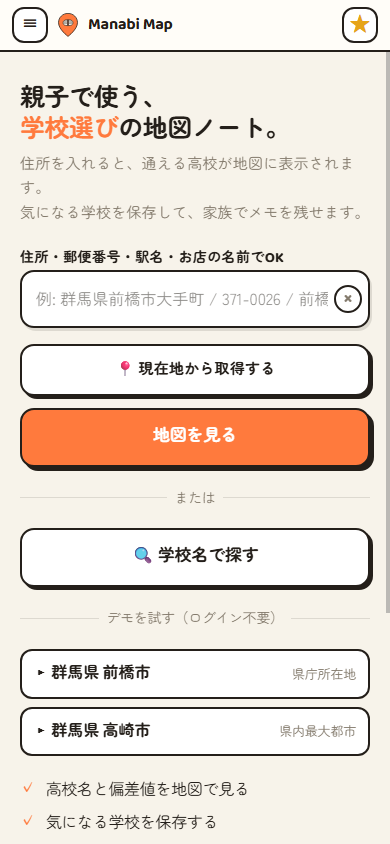
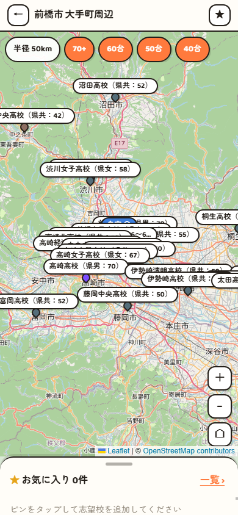

# 親子で使う、学校選びの地図ノート。

住所を入れると、周辺の高校が地図に出てきます。
気になる学校はワンタップでお気に入りに保存できます。
文化祭・説明会・通学経路・親子の感想を、学校ごとに家族でメモとして残せます。

**公開中 → https://manabi-map.app** （全国 47 都道府県・5,095 校に対応）

## 動作環境

- Web ブラウザで完結（アプリのインストール不要）
- スマホブラウザでの利用に最適化（基準画面幅 390px・iPhone 標準サイズ）
- ブラウザの「ホーム画面に追加」でアプリのように使えます（PWA・オフライン対応は今後拡充）

## スクリーンショット

  
  

## 使い方

1. **住所を入力する** — トップページに自宅の住所を入れると、周辺の高校が地図に表示されます
2. **気になる学校を保存する** — 地図上の学校をタップして、気になる学校をお気に入りに追加します
3. **家族でメモを共有する** — 文化祭や説明会で見聞きしたこと、通学経路の感想などを学校ごとに書き込みます。同じ LINE アカウントでログインすれば PC とスマホでメモが同期します

## 偏差値の扱いについて

掲載している偏差値は、**公的資料を参考にした Manabi Map の編集推計**です。公式偏差値・合格判定ではなく、根拠を確認できない学校は数値を掲載せず「情報提供募集中」としています。現在の掲載範囲・方法・限界は [偏差値の方法と限界](https://manabi-map.app/legal/deviation-methodology) を確認してください。特定の商用サイトや塾の資料からの数値転載は行っていません。

内容に誤りや修正すべき点を見つけた場合は、下記いずれかの方法でご連絡ください。

- GitHub Issue（`data-correction` ラベル）
- メール: takedown@manabi-map.app

## データセット

学校基本情報の公開データセットは [DATA.md](DATA.md) に説明しています。CC BY-SA 4.0 のライセンス、出典表記、偏差値の編集推計を含めない理由、リリース添付用 JSON / CSV の生成方法を確認できます。

## ライセンス

- **著作権**: Copyright (c) 2026 Hiroshi Ishizaka (ishizakahiroshi)
- **コード**: [AGPL-3.0-or-later](LICENSE)
- **公開データ（学校情報等）**: [CC BY-SA 4.0](https://creativecommons.org/licenses/by-sa/4.0/)
- **サードパーティライセンス**: [THIRD_PARTY_NOTICES.md](THIRD_PARTY_NOTICES.md)

## コントリビュート

学校情報の修正提案や誤りの報告は GitHub Issue でお願いします。データに関する Issue には `data-correction` ラベルを付けてください。コードの Contribution ガイドは順次整備していきます。

## ロードマップ

- **v0.1.0**（公開済）: 群馬県の主要高校を地図に掲載・お気に入り・家族メモ・LINE / 匿名ログイン
- **v0.1.2**（公開済）: 群馬県全域 78 校に拡大・クラスタ表示・4 モード所要時間・学科/偏差値フィルタ刷新
- **v0.1.3**（公開済）: 課程（全日/定時/通信）と連携校・全校生徒数・男女比・schools 静的化（Cloudflare Pages 経由）
- **v0.1.4**（公開済）: nightly-backup (R2 + age)・AdSlot 骨組み・attribution UX 改修
- **v0.1.5**（公開済）: データ層のフェイル・セーフ化（お気に入り楽観更新ロールバック等）・vitest 導入・Cloudflare Pages セキュリティヘッダ
- **v0.2**（公開済）: 関東 1 都 6 県 1,362 校への拡大・学科分類の master 化・SEO 基盤・偏差値修正ワークフロー
- **v0.3**（公開済）: 東日本 20 都道県 2,589 校への拡大（北陸・甲信越・東北・北海道）・入試実績（募集/志願/受検/合格）の表示
- **v0.3.1**（公開済）: 自宅設定後の初期ズーム改善（通学圏へ自動 fit）・「情報募集中」欄からの情報提供フォーム・管理者ダッシュボード完成・runtime メンテナンスモード切替（管理者 UI / CLI）・関東の私立高校の入試実績 1,145 行を追加投入（6 都県分）
- **v0.3.2**（公開済）: 入試選抜を募集単位・段階・区分・公式出典まで構造化し、学校統合の前身・後継を法的学校単位で分離。前身校の過年度入試を現行倍率へ混ぜずに閲覧可能
- **v0.3.3**（公開済）: メディア・教育関係者向けプレスキット、非管理者の管理画面リダイレクト、日次計測の空応答耐性を追加。西日本展開用の収集・検査ツールを整備（西日本データの本番投入は次版以降）
- **v0.4**（公開済）: 西日本 27 府県 2,522 校を追加し **全国 47 都道府県・5,095 校** へ拡大。「情報提供募集中」表示原則の web 反映（学科 / かな / 公式サイト URL の空欄に情報提供動線を紐付け）・メディア向け配布素材（ポスター / 配布資料）・サイト名表記の統一
- **v0.5**（公開済）: 都道府県ハブ 47 ページ・全域ハブ・統合検索を追加し、地図を開かずに学校を探せる導線を整備。学校ページに近隣校 / 沿革 / 第一次募集の年度表 / 学校規模を掲載。学校選びガイド 3 本を公開。偏差値の説明を「公的資料を参考にした編集推計」へ是正し「偏差値の方法と限界」ページを追加。データ二次利用方針（`DATA.md`・CC BY-SA 4.0）とプレスリリース PDF / ロゴ一式の配布を開始
- 以降: 偏差値相当情報は根拠を確認できた県・学校から掲載（全県の数値化は目標にしない）・家族共有の拡充・多言語対応・偏差値推計ロジックの公開などを検討

変更履歴の詳細は [CHANGELOG.md](CHANGELOG.md) を参照。

## リンク

- 本番サイト: https://manabi-map.app
