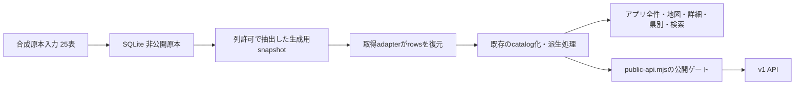

# SQLite学校原本: 生成器の依存表・型・公開契約

目的は、[SQLite詳細計画C1](plan_subdomain-entry-school-migration_c1_sqlite-static-source.md)の実装範囲を、現存する取得処理とDDLから定めること。2026-09-27、ローカルHEAD `704fd5579e4fae13b2a668263e3c9489a5c8066c` と作業ツリーを参照して設計・静的調査した。同日の後続作業でC1-a〜C1-eを合成実装・検証した到達点は末尾と計画へ記録する。実DBの現行schema確認済み、実データ移行済みを意味しない。

最小試作は学校・学科の一部と公開11列まで、合成20テスト成功済み。次の実装も合成データとリポ外一時領域に限定する。実データ、本番DB、認証設定、既存生成物を読み書きしない。build・commit・push・公開は行わない。最終URLはこの契約の決定に不要。

## 調査範囲と根拠

- [school-select.ts](../web/src/lib/school-select.ts): 学校33列と関連表の取得列、前身校の別名JOIN。
- [gen-schools-json.mjs](../web/scripts/gen-schools-json.mjs): 2本の取得ループ、募集単位の結合、出典catalog化、アプリ/地図/詳細/県別/検索/API/manifestの出力。
- [public-api.mjs](../web/scripts/lib/public-api.mjs): APIの列許可と出典ゲート。[mapPayload.ts](../web/src/lib/mapPayload.ts)、[admissionUnits.ts](../web/src/lib/admissionUnits.ts)、[admission.ts](../web/src/lib/admission.ts): アプリへの投影と倍率計算。
- [baseline_schema.sql](../web/supabase/baseline_schema.sql): publicのCREATE TABLE 43表、FK、PK/UNIQUE、CHECK、型、trigger関数、RLSを静的参照。generator直接参照13表を起点に、出方向FKを閉じると24表（マスター11表を追加）。旧新統計対応1表を原本保存に追加し25表とする。
- [migrations](../web/supabase/migrations/): 45ファイルを列挙し、対象表のDDL/制約・trigger・公開権限を検索。特に `202607070401` / `202607070402`（学科master）、`202607140101`（新入試）、`202607160101` / `202607160201`（沿革・安定キー）、`202608040107`（整合性）、`202608060201`（出典）、`202608070101`（公開説明）、`202608090101`（列権限）、`202609240102`（明示GRANT）を突合した。
- `scripts/` と `web/scripts/` のPython/JS/TS/PowerShell/shell 63ファイルを列挙し、SQL生成・DB操作の記述を検索した。実データSQLやfixture以外のデータファイルは調査入力にしていない。

列ごとの全DEFAULT/CHECK/FK/索引定義とマスターの全コードはDDLを実装時に再参照する（理由: 数百行のSQL写経による二重正本と陳腐化を避ける）。下記は保存範囲・生成への投影・移植時に落としやすい条件を固定する。migrationを実行してschemaを再構築した監査ではなく、本番の適用履歴やRLSの実効状態は未確認。

## 原本に保存する25表

原本では下記25表の既知の全列を保存対象とする。生成器のSELECTに無い列も、ID、版、出典、監査可能性の保持に必要。取込み時に未知列を黙って捨てる最小試作の契約は、完全原本用には引き継がない。未対応表/列/型は取込み前に拒否し、対応を決めてから版を上げる。新規のUUIDやrecord_keyを自動発番しない。

### 直接読む13表と、原本保存の追加1表

「生成器へ渡す列」は現在の取得契約。各表の列順・NULL可否はDDLを正本とする。

| 表 | 主な保存キー・参照 | 生成器へ渡す列／注意 |
|---|---|---|
| schools | id、独立record_key。lifecycle/recruitment master参照 | 下記33列。原本はcreated_at/status_noteも保存するが生成へ渡さない |
| school_departments | id、独立record_key、school_id、course_type FK | id, school_id, name, course_type, ui_group。原本のcreated_at/record_keyは生成列に追加しない |
| school_deviation_values | id、school_id、department_id（NULL可） | department_id, value, is_active。原本はyear, source_type, estimate_method, note, estimate_basis, created_at, updated_atも保持。APIには出さない |
| school_admission_stats | id、school_id、department_id（NULL可）、year | id, department_id, year, capacity, applicants, examinees, admitted, note, source_url。原本のcreated_at/updated_atも保持。旧表を新統計の集計に混ぜない |
| school_field_sources | school_id, field_name, official_urlの複合PK。field_nameはmaster FK | field_name, official_url, doc_title, published_at, source_page_or_table, last_verified_at, last_http_status, is_official_source。note/created_atは原本のみ |
| school_relationships | id、predecessor_school_id、successor_school_id、関係master | id, relationship_type_code, effective_on, official_url, notes と前身校投影。原本はeffective_admission_year/evidence_status/両timestampも保持 |
| school_name_history | id、school_id | id, name, name_kana, valid_from, valid_to, official_url, notes。created_at/updated_atは原本のみ |
| admission_recruitment_units | id、school_id、学校内unit_key、種別master | school_id, id, unit_key, unit_kind_code, label, course_time, valid_from_year, valid_to_year。created_at/updated_atは原本のみ |
| admission_recruitment_unit_departments | unit_id, department_idの複合PK | department_id。原本はcreated_atも保持 |
| school_admission_selection_stats | id、recruitment_unit_id、段階/区分/地図役割master | id, year, selection_stage_code, selection_track_code, stage_label_raw, track_label_raw, selection_scope_raw, population_scope_raw, scope_key, map_role_code, is_ratio_comparable, capacity, applicants, examinees, admitted, exam_scope_raw。両timestampは原本のみ |
| school_admission_stat_exam_components | stat_id, component_codeの複合PK。component master | component_code。created_atは原本のみ |
| school_admission_stat_quality_flags | stat_id, metric_code, reason_codeのNULL同値UNIQUE。reason master | metric_code, reason_code, note。created_atは原本のみ |
| school_admission_stat_sources | stat_id, fact_kind_codeの複合PK | fact_kind_code, official_url, doc_title, published_at, source_page_or_table, quoted_evidence, last_verified_at, last_http_status。created_atは原本のみ |
| school_admission_stat_legacy_links | stat_id, legacy_stat_idの複合PK、created_at | **生成器は読まない**。`gen-admission-v2.mjs` が書く旧新対応を原本から落とさないため追加。公開snapshotへ渡さない |

学校33列は次の通り（`GENERATOR_SCHOOL_COLUMNS`）:

```text
id, name, name_kana, type, ownership, gender_type, is_integrated,
postal_code, prefecture, city, address, latitude, longitude, official_url,
is_active, is_recruiting, updated_at, course_times, main_school_name,
campus_type, total_students, enrollment_year, male_ratio, record_key,
lifecycle_status_code, recruitment_status_code, legally_established_on,
opened_on, recruitment_ended_on, closed_on, status_official_url,
recruitment_ended_year, status_description
```

### 参照マスター11表

全て `code` を主キーに原本保存し、参照されるinactiveコードも落とさない。分類masterにあるis_activeと、学校の公開対象判定を混同しない。ラベル・並び順・notes・timestampも原本へ保存し、マスター表そのものは生成snapshotへ出さない。

| 表 | 利用する参照・挙動 |
|---|---|
| course_type_master | 学科course_type FK、ui_group同期。mext_category/detail, classification_sourceを保持 |
| school_lifecycle_status_master | lifecycle_status_code FK。is_map_active、forces_not_recruiting |
| school_recruitment_status_master | recruitment_status_code FK。is_recruiting_compat |
| school_relationship_type_master | relationship_type_code FK |
| school_field_source_field_master | field_name FK。table_name/column_nameとcodeの一致、組の一意性 |
| admission_recruitment_unit_kind_master | unit_kind_code FK |
| admission_selection_stage_master | selection_stage_code FK |
| admission_selection_track_master | selection_track_code FK |
| admission_map_role_master | map_role_code FK |
| admission_exam_component_master | component_code FK |
| admission_quality_reason_master | reason_code FK |

### 原本から除外する範囲

baseline public 43表のうち、25表以外の18表は以下。学校への逆方向FKがあっても、利用者・受付・運用データを取り込まない。auth schemaも対象外。SQLite側へユーザーIDや管理権限を持ち込まず、Supabase側のFK/RLSはC3/C4まで維持する。（10/1 注: 利用者データを D1＋Better Auth へ移す決定（9/30）により、移行後に整合と本人限定を保つ場所は D1 と Worker になる。移行の計画は docs/local/plan_auth-cloudflare-migration.md）

- 利用者保存6表: user_school_favorites, user_school_notes, user_school_deviations, home_locations, family_groups, family_members。
- 受付/補正監査2表: data_reports, deviation_correction_logs。管理者・利用者IDを含むため移さない。採用された学校側の値だけ別の受付→原本更新経路へ接続する（C3）。
- 運用/計測10表: admin_users, admin_pin_attempts, app_config, events, dash_cf_dims, dash_cf_referers, dash_daily, dash_gsc_pages, dash_gsc_queries, dash_supabase_usage。

## 型と整合性の移植契約

| PostgreSQL / 対象 | SQLite原本の方針 | 復元・比較条件 |
|---|---|---|
| UUID / 全idとFK | 正規形TEXT。新規発番なし | 既存id/keyの対応不変。FKは接続ごとON、commit前foreign_key_check |
| record_key / unit_key / scope_key / master code | TEXT。一意性・非空・参照制約を個別移植 | school-/department-のUUIDとidは別。unit_keyは学校内一意 |
| boolean | INTEGER 0/1＋CHECK。JSON入力はtrue/falseのみ | JSON出力はboolean。1、文字列、NULLへの暗黙補正をしない |
| integer / value, 年度, 人数, 割合, status | INTEGER、列ごとの範囲検査 | NULLと0を区別。year 2000〜2100と沿革年1900〜2100を一律にしない |
| numeric(10,7) / latitude, longitude | Decimalで検証した固定小数7桁TEXTを第一実装とする | 取込みでfloatへ丸めない。生成snapshotは明示変換したJSON number。合成境界値で7桁往復とJS number互換を検証 |
| date / 沿革、published_at | YYYY-MM-DD TEXT、NULL可否は列ごと | 時差を付けず、実在日と日付順を検証。空文字へ置換しない |
| timestamptz / created_at等 | 時差付きISO TEXT | 元時刻を保持し、取込み・再取込みでnow()へ書換えない。JSON/比較で時差表現差を明示する |
| school_course_time[] / course_times | JSON配列TEXT＋要素/非空検証 | fulltime/parttime/correspondence。順序を保持、NULL/空配列/未指定を混同しない |
| enum / campus_type, course_time | 列ごとのTEXT CHECK | campusはmain/partner_school/satellite_campus/support_school。course_timeは上記3値で募集単位はNULL可 |
| nullable TEXT / notes等 | TEXT/NULLを保持 | NOT NULL、空白拒否、長さ制限がある列だけ拒否。全TEXTへ試作のnonempty条件を流用しない |

実装時に維持する制約:

1. `school_admission_stats(school_id, department_id, year)` とquality_flagsのUNIQUE NULLS NOT DISTINCTをSQLiteの通常UNIQUEで代用しない。NULL用・非NULL用の部分unique index等で同じ重複を拒否する。
2. 学科ごとのactive偏差値、学校/募集単位key、年度/段階/区分/scopeの選抜統計、名称履歴/関係のNULL安全な一意性を移す。新統計と旧統計を両方残しても二重集計しない。
3. 学科のui_groupとcourse master、学校のis_active/is_recruitingと状態masterを照合する。現行triggerは一部を導出/上書きするが、移行取込みは矛盾を黙って補正せず失敗させる。更新時の導出処理は原本更新契約として明示する。
4. 募集単位と所属学科は同じschool_idでなければ拒否する。membershipだけでなく学科/募集単位の親更新後も検査する。
5. `is_ratio_comparable=true` はcapacity>0かつapplicants非NULL、primary_totalはprimaryかつ比較可能。人数の非負、年度・日付の範囲/順序、自己関係禁止も保持する。
6. 出典のHTTP(S)、last_verified_atとlast_http_statusの組、100〜599、quoted_evidenceの非空/80文字以内、field master参照を保持。到達状態404を理由に出典を削除しない。
7. 全表取込みを1transactionにまとめ、master→schools→departments/履歴/関係/旧統計/偏差値/出典→募集単位→membership/新統計→新統計の子表/旧新対応の順で書く。最後に全表整合を検査して版を確定する。

最小試作のschema 1は完全原本ではない。欠落した列を捏造して自動upgradeせず、新しいschema/purposeを持つ別の合成DBを作る。既存ファイルの黙った置換は禁止。正式なschema migrationと更新方式はC1内で実装・検証し、初回拡張では削除や全置換を暗黙に足さない。合成fixtureの形式を明示して既存20テストを維持する。

## 生成器へ渡すsnapshotと公開条件



### 取得adapterの戻り値

現行の2取得ループと同等の、**sourceCatalogへ圧縮する前のrows**を返す。学校本体はis_active=trueを採用し、公式URLなしをこの段階で落とさない。前身校はinactiveでも必要な5列 `id, record_key, name, lifecycle_status_code, closed_on` を保持し、前身校の募集単位も結合する。全schoolsをactiveだけに絞って原本へ保存してはいけない。

学校行の子はschool_departments、school_deviation_values、school_admission_stats、school_field_sources、school_name_history、`predecessor_relationships`（関係＋`predecessor`投影）、admission_recruitment_units。募集単位の子にmembershipと新統計、新統計の子にexam_components/quality_flags/sourcesを復元する。空の複数関連は `[]`、nullable scalarは `null`。私的な原本全列を `SELECT *` でrowsへ流さない。

学校はprefecture/name/id、UUID子表はid、複合キー表は各keyによる順序を固定する方針。既存取得は学校の同名tieや子配列の順序を完全指定していないため、最初の比較は両入力を同じ規則で正規化して内容一致を測る。順序変更により画面・sourceCatalog番号・内容hashが変わることを無条件に許容せず、合成テストで表示上意味のある順序を別に検査する。

### アプリ配布とv1 APIを区別する

| 出力 | 維持するゲート |
|---|---|
| アプリ全件/県別 | 既存SELECTに沿ったactive学校と関連データ。偏差値・旧統計note・入試quoted_evidence等の既存取得列を保持。原本のみのstatus_note等は出さない |
| 地図/一覧 | `buildMapPayload` の列投影と `primaryAdmissionTrend` を再利用。独自の倍率計算を追加しない |
| 学校詳細/検索/近隣/SEO | 座標が両方存在する集合、共有の近隣/後継/市区町村解決を維持 |
| v1 APIの学校 | active=trueかつHTTP(S)公式URL。URLゲートで県が全欠落する場合の生成停止を維持 |
| APIの基本列 | BASIC_FIELDS。座標/course_times/campus_typeは非公式出典が既知で公式が無いと削除。全基本列に一律の出典必須条件を足さない |
| APIの出典必須列 | total_students/enrollment_year/male_ratio/status_descriptionは対応する公式field source。学科name/course_typeはそれぞれのfield source |
| APIの沿革・関係 | lifecycleはstatus_official_urlが有効な場合。名称履歴と前身校は既存のname/record_key条件とURLのnull化を維持。history/relationshipのnotesは現行APIに含まれるため、`note`という名前だけで一括除外しない |
| APIの新入試統計 | quality_flagsが1件でもあればその統計全体を除外。HTTP(S)出典のある指標のみ。指標0件なら統計、統計0件なら募集単位を除外。quoted_evidence/last_http_statusはAPIの出典投影には出ない |

既存の `public-api.mjs`、`mapPayload.ts`、`admissionUnits.ts` を再利用し、Pythonでこれらの全ゲートを別実装しない。Pythonの試作11列exportは別formatとして維持し、正式snapshotをその出力に置き換えない。

### manifestと副作用の境界

新しいローカルsnapshot manifestにはformat/schema版、dataset版、source版、作成日時、全25表の件数、正規化内容SHA-256、snapshotファイルSHA-256、生成コードの識別情報を持たせる。dirty作業ツリーではHEADだけを「検証したコード」と記録せず、対象コードの内容hashも持たせる。作成日時を内容hashから除き、同一入力で内容一致を検査する。保存先の私的な絶対パスを公開manifestへ出さない。

既存の `schools-manifest.json`（hash付きURL、map/index/detail/県別のURLや件数、formatVersion:2）とは別契約。既存のhashを全ファイルSHA-256と誤記しない。正式ローカルsnapshotとmanifestの両方を完了させ、検証後に候補ディレクトリを確定する設計をC1で実装する。

`gen-schools-json.mjs` はpublic出力を行うためテストから直接importしない。C1-eで `web/scripts/lib/school-source.mjs` と同テストへ副作用のない検証/変換を分離し、明示的に選ばれた入力だけを読むようにした。ローカル入力失敗時のSupabaseへの暗黙フォールバックは禁止。Supabase経路は明示選択の比較/復旧用として残し、env読取・client importはその経路の選択後に限定する。packageの既存生成コマンドは明示supabaseを使用し、運用切替は未実施。

自治体JSON・サイト設定・package version・学科グループ符号化も生成器の非DB依存として残す。学校DBへ詰め込まず、テストでは合成の自治体/学校入力を使う。gen-seo-pagesへの接続やpublic/dist生成を今回の調査で実行しない。

## 原本への書込み経路と後続工程

| 現存する入口 | 観測した動作 | 引継ぎ |
|---|---|---|
| scripts/admission/gen-admission-v2.mjs | 募集単位を対象範囲でDELETE後INSERTし、新統計と子表、旧新対応のSQLを生成 | C1のupsertへそのまま投入しない。削除の意味・identity維持・対象範囲を定め、C3で更新受付を接続 |
| scripts/local/estimate/gen-admission-stats.mjs | 旧入試統計のDELETE/INSERT SQL生成 | 旧表の保持と新表との二重集計防止。実行していない |
| scripts/local/estimate/estimate-deviation.mjs | school_deviation_valuesへのINSERT SQL生成 | source_type/estimate_basis/active条件を移植。実行していない |
| SchoolDetailSheet.tsx → correct_school_deviation | 学科単位の補正RPC。DB関数が偏差値と補正ログへ書く | C3で受付と原本採用に分離。現行RPC/管理権限は変更しない |
| DashboardPage.tsx | 受付に紐づく学校名/学科名をSupabaseから直読 | C3の参照切替対象。学校原本をコピーしただけで削除しない |
| official-fetch / mext-schools-fetch | 外部資料の取得・ファイル出力 | 今回未実行。原本取込み前の採用審査を省かない |

SQL生成以外の学校更新を全経路追跡した運用監査ではない。今回の検索対象は上記63スクリプトと既知の管理画面/RPCであり、リポ外の手動SQL、外部job、実際の適用経路はC3/C4で確認する。maintenance・dashboard・smoke-supabaseは設定/利用者表等の別用途で、学校原本CLIへ統合しない。

## 次の実装順と合成受入条件

2026-09-27、C1-aに続き、ユーザー承認に基づきC1-b〜C1-eを並列分担・統合して合成検証した（[計画の実施記録](plan_subdomain-entry-school-migration_c1_sqlite-static-source.md#c1-b-through-e)）。以下は全て合成検証までであり、実データの原本移設や本番受入ではない。

| 順序 | 内容・対象 | 完了条件 |
|---|---|---|
| C1-a（合成検証済み） | schools/school_departments/school_field_sourcesとcourse/lifecycle/recruitment/field-sourceのmaster、計7表。schema/入力版を分離 | 全列と型、ID、未知列拒否、状態整合、出典の公式/非公式/不在を合成で検証。試作20テストも維持 |
| C1-b（合成検証済み） | name_history/relationships/relationship master、計3表を追加 | inactive前身校、同名別ID、改称、NULL境界、自己関係、重複関係を検証 |
| C1-c（合成検証済み） | 旧統計/偏差値、新入試6表、旧新対応と入試master6表、計15表を追加 | 25表の閉包完成。NULL一意性、別学校membership拒否、指標ごとの出典、品質フラグ、二重集計防止 |
| C1-d（合成検証済み） | 全表transaction、正式snapshot/manifest、schema版の扱いを完成 | 中間候補を完成品として残さず、同じ入力の内容hash一致、破損/版不一致/全表途中失敗を拒否 |
| C1-e（合成検証済み） | 明示入力adapterと既存の純粋変換処理との比較 | 同一合成データでrows/アプリ/API/地図の内容・ID・公開列一致。外部接続とenv読取なしでテストできる |

学校25表は `scripts/local-data/store_school.py` / `school_history.py` / `school_admission.py` とSQL3本、`example.school.synthetic.json` を使う。schema 3 / purpose・input format `synthetic-school-source` / input_version 1、dataset_versionとsource_versionを明示。schema 1/2は別ファイルのまま維持し、schema 2からの移行は旧7表の全行・全列を検証して新規DBへ写す明示 `--from-core` のみ。旧原本に未知列/表がある場合は欠落させず拒否する。

正式候補はsnapshot.json（13表の許可列＋関連結合FK）とmanifest.json（版、時刻、全25表件数、正規化内容/ファイルhash、15コードファイルの内容識別）からなる。両者を一時領域で完成・検証後、出力先を排他的に予約してmanifestを最後に置く。manifestの無い途中ディレクトリはadapterが拒否する。ハッシュ正規化はキー辞書順、配列順保持、数値指数なし・末尾0なし、UTF-8。作成時刻は内容hashに含まれない。詳細なコマンドと限界は [CLI README](../scripts/local-data/README.md) に集約する。

`web/scripts/lib/school-source.mjs` がsnapshotの版/hash/列/基本型/参照を検査して取得形を復元し、既存のcatalog化・アプリ変換・地図倍率・公開APIを再利用する。合成Python94テスト、JS adapter12テスト、既存入試/地図26テストが成功。Pythonが生成した合成bundleを実際のJS adapterで読み、コード識別15パスと座標境界の契約一致も確認した。実生成器全体・public/dist生成・Preview/本番受入は未実施。

C1の未完了には学校以外のサービスへの共通manifest契約も残る。本書の実装・検証は学校版だけであり、土地/漢字/かるたの私的スキーマを調査済みとしない。C1全体のplannedを維持し、C2の世代バックアップ、C3/C4の本番運用へは自動で進めない。
